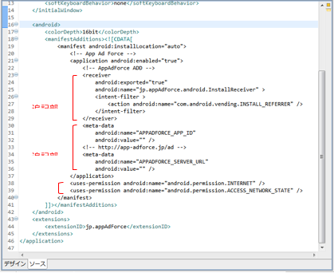

#Androidに導入する

Flexプロジェクトに組み込まれたAIRアプリケーション記述子を編集します。
AIR アプリケーション記述子とはMXMLアプリケーションに対応する○○○-app.xmlの事です。

1. &lt;manifest&gt; ～ &lt;/ manifest&gt;内に、以下の設定を追加する。

		<uses-permission android:name="android.permission.INTERNET" />
		<uses-permission android:name="android.permission.ACCESS_NETWORK_STATE" />

2. &lt;application&gt; ～ &lt;/application&gt;内に、以下の設定を追加する。

		<receiver android:name="jp.appAdForce.android.InstallReceiver" android:exported="true">
			<intent-filter>
				<action android:name="com.android.vending.INSTALL_REFERRER" />
		   </intent-filter>
		</receiver>

3. &lt;application&gt; ～ &lt;/application&gt;内に、以下の設定を追加する。

		<meta-data android:name="APPADFORCE_APP_ID" android:value="1" />
		<meta-data android:name="APPADFORCE_SERVER_URL" android:value="0117d62807ed～c0eb4" />
		<meta-data android:name="APPADFORCE_CRYPTO_SALT" android:value="0117d62807ed～c0eb4" />

> ▼ パラメーター<br>
> APPADFORCE_APP_ID：アプリごとに発行されるID ⇒ 管理者より連絡します。<br>
> APPADFORCE_SERVER_URL：通信先を示す文字列 ⇒ 管理者より連絡します。<br>
> APPADFORCE_CRYPTO_SALT：HASH-SALT文字列 ⇒ 管理者より連絡します。<br>



### 複数のInstallReceiverを共存させる場合の制限事項

※ 現在F.O.X AIRエクステンションは複数のエクステンションでのInstallReceiverの共存に対応していません。
※ 別のエクステンションにInstallReceiverの転送機能があれば、そちらを利用してF.O.XのInstallReceiverを呼び出してください。


## AndroidManifest.xmlで指定可能なオプション

### Google Play Services 設定

Google Play Servicesの設定のために&lt;application&gt; ～ &lt;/application&gt;内に、以下を追加してください。

	<meta-data
		android:name="com.google.android.gms.version"
		android:value="@integer/google_play_services_version" />

### Google Playデベロッパープログラムポリシーの準拠

Force Operation X Android SDKはGoogle Playデベロッパープログラムポリシーに準拠しています。本SDKはポリシーに準拠するために、永続的なデバイスID (IMEI及びMACアドレス) が取得される場合には広告IDが取得されません。2014年8月1日から、Playストアにアップロードされたすべての更新や新着アプリには、広告目的で使用する端末IDには広告IDを利用する必要があります。

## 外部ストレージを利用した重複排除設定

アプリケーションの初回起動時にSDKが生成した識別IDをローカルストレージまたはSDカードに保存することで、アプリケーション再インストール時に重複判定を行うことができます。

本設定は必須ではありませんが、アプリケーションの再インストールにおける重複検知の精度が大きく向上するため、実装を推奨しております。

### パーミッションの設定

外部ストレージへのファイル読み書きに必要なパーミッションの設定をAndroidManifest.xmlの&lt;manifest&gt;タグ内に追加します。

```xml
<uses-permission android:name="android.permission.READ_EXTERNAL_STORAGE" />
<uses-permission android:name="android.permission.WRITE_EXTERNAL_STORAGE" />
```

上記パーミッションが設定されている場合、次のパスに識別IDファイルが保存されます。

```
Environment.getExternalStorageDirectory().getPath()で取得できるパス/アプリのパッケージ名/__FOX_XUNIQ__
```

### （任意）保存ディレクトリ及びファイル名の変更

保存されるファイルのディレクトリ名は、標準ではパッケージ名で作成されますが、&lt;application&gt;タグ内に以下設定を追加することで、任意のディレクトリ名及びファイル名に変更することができます。

```xml
<meta-data android:name="APPADFORCE_ID_DIR" android:value="任意のディレクトリ名" />
<meta-data android:name="APPADFORCE_ID_FILE" android:value="任意のファイル名" />
```

> 任意のディレクトリ名やファイル名を指定した場合でも、Environment.getExternalStorageDirectory().getPath()の返り値のパス配下に作成します。Environment.getExternalStorageDirectory().getPath()の返り値は端末やOSバージョンによって異なります。 
> "APPADFORCE_ID_DIR"(任意のディレクトリ名)を指定せず、任意のファイル名のみを指定した場合、アプリのパッケージ名のディレクトリが作成され、その配下に任意のファイル名で保存されます。 
> ※"APPADFORCE_ID_FILE"(任意のファイル名)を指定せず、任意のディレクトリ名のみを指定した場合、任意の名前でディレクトリが作成され、その配下に"__FOX_XUNIQ__"で保存されます。
通常は設定の必要はありません。


### 設定例

AndroidManifest.xmlの設定例を次に記載します。

```xml
<uses-permission android:name="android.permission.READ_EXTERNAL_STORAGE" />
<uses-permission android:name="android.permission.WRITE_EXTERNAL_STORAGE" />

<application 
	android:icon="@drawable/ic_launcher"
	android:label="@string/app_name" >
	
	<meta-data android:name="APPADFORCE_ID_DIR" android:value="fox_id_dir" />
	<meta-data android:name="APPADFORCE_ID_FILE" android:value="fox_id_file" />
	
</application>

```

上記の例の場合に、保存されるファイルのパスは次になります。

	Environment.getExternalStorageDirectory().getPath()で取得できるパス/fox_id_dir/fox_id_file


### 外部ストレージの利用停止

Force Operation X SDKによる外部ストレージへのアクセスを停止したい場合には、AndroidManifest.xmlにAPPADFORCE_USE_EXTERNAL_STORAGEの設定を追加してください。


```xml
<meta-data android:name="APPADFORCE_USE_EXTERNAL_STORAGE" android:value="0" />
```

本設定を行うことで外部ストレージに対する記録が停止しますが、アプリケーションの削除によりデータが常に初期化されるため、正確なインストール計測が行われなくなります。
