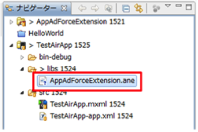
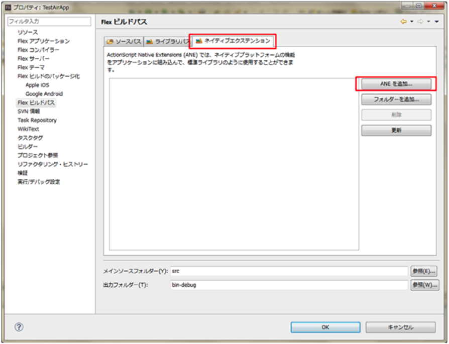
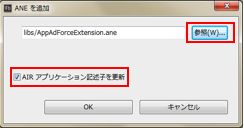
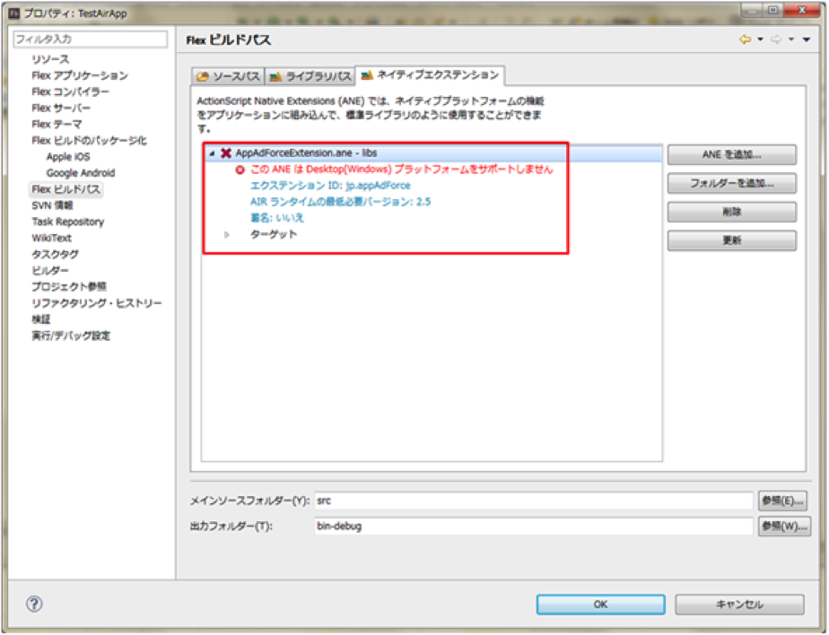
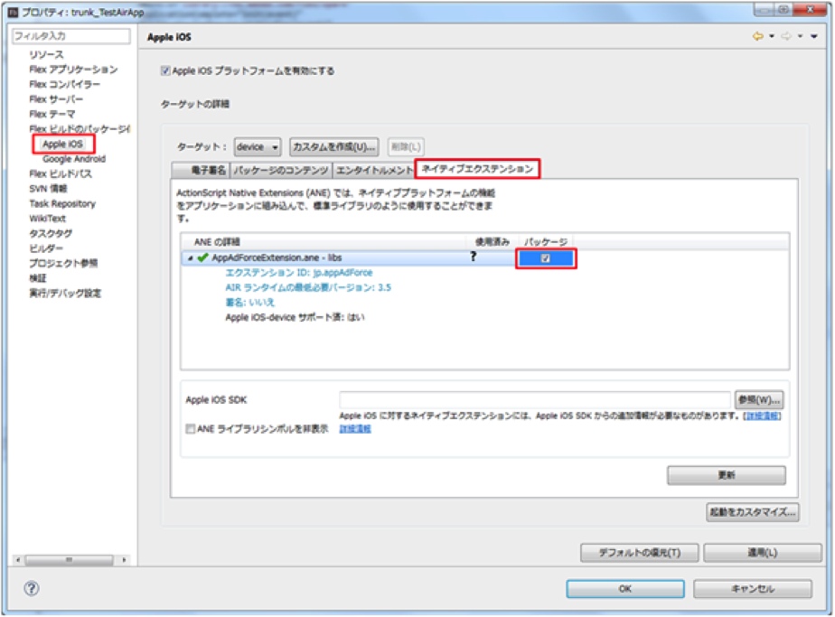
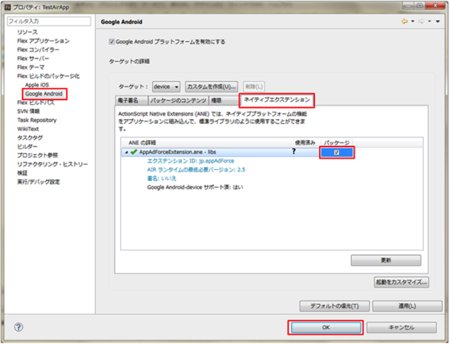

# Force Opetaion Xとは

Force Operation X (以下F.O.X)は、スマートフォンにおける広告効果最適化のためのトータルソリューションプラットフォームです。アプリケーションのダウンロード、ウェブ上でのユーザーアクションの計測はもちろん、スマートフォンユーザーの行動特性に基づいた独自の効果計測基準の元、企業のプロモーションにおける費用対効果を最大化することができます。

本ドキュメントでは、スマートフォンアプリケーションにおける広告効果最大化のためのF.O.X SDK導入手順について説明します。

## F.O.X SDKとは

F.O.X SDKをアプリケーションに導入することで、以下の機能を実現します。

* **インストール計測**

広告流入別にインストール数を計測することができます。

* **LTV計測**

流入元広告別にLife Time Valueを計測します。主な成果地点としては、会員登録、チュートリアル突破、課金などがあります。各広告別に登録率、課金率や課金額などを計測することができます。

* **アクセス解析**

自然流入と広告流入のインストール比較。アプリケーションの起動数やユニークユーザー数(DAU/MAU)。継続率等を計測することができます。

* **広告配信**

アプリ内に相互集客広告を表示させることができます。尚、広告表示が不要の場合には、本項目の実装を省略できます。

# 1.	概要

本ドキュメントでは、Force Operation X SDK Airエクステンションの導入手順について説明します。Force Operation X SDK AirエクステンションはiOSおよびAndroidに対応しています。

Force Operation X SDKでは、インストールおよびLTVの計測、アクセス解析を行うことができます。

SDKの実装後は、アプリケーションの動作及び効果測定の結果に問題のないことを確認した後にマーケットへの申請を行ってください。効果測定のテスト手順については、Force Operation X管理者よりご連絡いたします。


## 1.1	SDK仕様

F.O.X SDKをアプリケーションに導入することで、以下の機能を実現します。

|処理|必須|概要|
|:------:|:------:|:------|
|インストール計測|必須|起動時はブラウザが起動し、Cookie計測により広告効果測定を行います。<br>コンバージョン数、CVRなどを測定することができます。<br>メソッド名：sendConversion|
|LTV計測|オプション|任意の成果地点で成果通知を行い、広告別の課金数や入会数の計測を行います。<br>課金金額、退会数などを測定することができます。<br>メソッド名：sendLtv|
|アクセス解析|オプション|アプリの起動時およびバックグラウンドからの復帰時の起動計測を行います。<br>起動数、アクティブユーザー数(DAU)、継続率などを測定することができます。<br>メソッド名：sendStartSession|

## 1.2 SDKの展開

AppAdForce_AIR_Extension_<version>.zipを展開すると以下２つのファイルが存在します。F.O.X SDKの動作にはGoogle Play Servicesが必要になり、通常はあらかじめGoogle Play Servicesが組み込まれたwithGooglePlayServicesをご利用ください。

既にGoogle Play Servicesを利用されているか、もしくは別バージョンのGoogle Play Servicesをご利用されたい場合にはwithoutGooglePlayServicesを選択し、ご自身でGoogle Play Servicesの導入を行う必要があります。
また、Android版をビルドせずiOSのみビルドする際はGoogle Play Servicesは不要です。

|ファイル|概要|
|:----|:----|
|withGooglePlayServices/AppAdForceExtension.ane|Google Play Services, version 4.4 (4452000) ライブラリを内包しています。|
|withoutGooglePlayServices/AppAdForceExtension.ane|Google Play Servicesライブラリを内包していません。ご自身でGoogle Play Servicesを導入する必要があります。|

## 1.3 OSサポートバージョン

* iOS : 7.0以上
* Android : 4.0以上

## 1.4 Adobe AIR SDK サポートバージョン

* Google Play Services非内包版：Adobe AIR SDK 20 以上
* Google Play Services内包版：Adobe AIR SDK 20 以上


# 2 AIRエクステンション導入手順(FlashBuilder)

## 2.1	Airエクステンションをプロジェクトに追加

1. Flash Builderを起動して、エクステンションを組込むFlexモバイルプロジェクトを選択する。
2. AppAdForceExtension.aneをプロジェクト配下に配置する。<br>
　 ここではlibsに配置していますが指定はありません。　



3. Flexプロジェクト上で、右クリック→「プロパティー」を選択する。
4. 左側に見えるツリーから「Flexビルドパス」を選択する。
5. 右側のメイン画面にある「ネイティブエクステンション」タブを選択する。
6. ANEを追加ボタンを押下する。<br>

7. 「AppAdForceExtension.ane」を選択する。<br>

8. AIRアプリケーション記述子を更新にチェックを付けたままOKボタンを押下する。
9. メイン画面に「AppAdForceExtension.ane」が表示されていることを確認する。




## 2.2 ビルドのパッケージ化

※ OSによって手順が異なります。

### 2.2.1 iOSに導入する

1. 左側に見えるツリーから「Flexビルドのパッケージ化」＞「Apple iOS」を選択する。
2. 右側のメイン画面にある「ネイティブエクステンション」タブを選択する。
3. パッケージにチェックを付けてOKボタンを押下する




### 2.2.2 Androidに導入する

1. 左側に見えるツリーから「Flexビルドのパッケージ化」＞「Google Android」を選択する。
2. 右側のメイン画面にある「ネイティブエクステンション」タブを選択する。
3. パッケージにチェックを付けてOKボタンを押下する




### 2.3 コードの編集

コードの編集は、通常 メインMXMLアプリケーションに行います。
メインMXMLアプリケーションとは、アプリ起動時に、一番最初に表示される画面になります。

1. jp.appAdForce.AdLtvManagerクラスをインポートする。

		import jp.appAdForce.AdLtvManager;


2. AppAdForceをインスタンス宣言する。

		private var ad:AdLtvManager = new AdLtvManager();


3. 成果計測用のコードをメインMXMLアプリケーションに追加します。<br>
　 ※ ここでは初期処理イベントハンドラで計測する方法を記述します。


		<s:Application xmlns:fx="http://ns.adobe.com/mxml/2009"
					   xmlns:s="library://ns.adobe.com/flex/spark"
					   applicationComplete="init(event)">
			<fx:Script><![CDATA[
				import jp.appAdForce.AdLtvManager;
				private var ad:AdLtvManager = new AdLtvManager();
				import mx.events.FlexEvent;
				protected function init(event:FlexEvent):void {
					ad.sendConversionWithStartPage("http://○○○○");
				}


sendConversionWithStartPage関数の引数はURLになります。
アプリ起動時に表示させたいページのURLをご指定ください。<br>
※ページのご用意が無い場合は、ページの作成をお願い致します。

ブラウザに表示するページが特に無い
場合は、以下のように文字列`”default”`を渡してください。

	ad.sendConversionWithStartPage("default");


※ デフォルトのページはアプリを特定せず汎用的にご使用いただくため、デザイン・内容ともに非常にシンプルなものになっております。各広告主様に共用いただく形となるため、自由な変更も行えません。
広告主様で独自に作成されましたオリジナルページをご使用いただくことを推奨いたします。

##### 【 起動時以外で成果計測を行いたい場合 】
起動時以外のタイミングでブラウザを開き、そのタイミングで成果計測を行いたい場合には
任意の場所(ボタン押下のコールバックなど)に、以下のように記述してください。

	ad.sendConversionWithStartPage("http://○○○○");

### 2.4 設定ファイルの編集

※OSによって手順が異なります。

### ・[iOSの設定](./doc/setting_ios/README.md)
### ・[Androidの設定](./doc/setting_android/README.md)

# 3 LTV計測の実装

## 3.1 LTV計測概要

##### ・LTVの定義
Force Operation X内でのLTVとは、“アプリDL後のアクション”を指します。

##### ・LTV地点について
主にアプリ内課金、資料請求、会員登録、商品購入など広告におけるCV地点になりますが、“ユーザー”のアクション地点であれば、自由にご設定頂くことが可能です。<br>
(アプリ起動時、チュートリアル完了、特定ページ到達など)

##### ・LTV地点の登録数について
複数地点での登録が可能になります。<br>
事前にForce Operation X担当者までご希望をご連絡下さいませ。

LTV計測により、広告流入別の課金金額や入会数などを計測することができます。計測のために、任意の地点にLTV成果通信を行うコードを追加します。

## 3.2 コードの編集

コードの編集は、通常、成果が上がった後に実行されるMXMLアプリケーションに処理を記述します。例えば、会員登録やアプリ内課金後の課金計測では、登録・課金処理実行後のコールバック内にLTV計測処理を記述します。

1. jp.appAdForce.AdLtvManagerクラスをインポート

		import jp.appAdForce.AdLtvManager;

2. LTV計測処理を行うオブジェクトの生成

		AdLtvManager ad = new AdLtvManager()

3. 計測種類に応じた設定を行う<br>
以下、計測種類に応じて組み込んでください。

###### <アプリ内でLTV計測を行う><br>
成果がアプリ内部で発生する場合、成果処理部に以下のように記述してください。

	ad.sendLtv(成果地点ID);

成果地点ID(必須)：管理者より連絡します。その値を入力してください。

[sendLtvの詳細](./doc/send_ltv_conversion/ja)


## 3.3 動作確認

動作テストを実施する際は、インストール計測（インストールからアプリ起動時の成果計測）実行後、アプリ上で成果地点に到達してください。インストール計測において成果がない場合にはLTV計測が行われません。


# 4 アクセス解析

## 4.1 アクセス解析について

・広告効果測定ツール『Force Operation X』(以下F.O.X)のアドオン機能

・F.O.X SDKの最新版をインストールすることにより、F.O.Xの広告効果計測に加え、広告流入別に「アクティブユーザー数」や「課金ユーザー数」、「イベント実行数」などを分析することができ、インストール数だけではなく、アプリケーションを利用するユーザーの質や動向に着目した広告運用が可能となります。

・F.O.X SDK v2.8以降でアクセス解析の機能を利用できます。

**※	本SDKはマルチスレッドに対応していません。必ず全てのAPIをメインスレッドから実行するようにしてください。**

## 4.2 アクセス解析SDK導入の流れ

アクセス解析を行うには、ソースの編集が必要になります。

全体の流れは、以下のようになります。

ソースの編集

1. プジェクとにライブラリを追加
2. app.xmlにANALYTICS_APP_KEYを追加(Android)<br>
AppAdForce.plistにANALYTICS_APP_KEYを追加(iOS)
3. ソースコードを編集し、セッション開始のコードを追加

動作確認

## 4.3 コードの編集
コードの編集は、通常全てのMXMLアプリケーションに行います。

1. jp.appAdForce.AnalyticsManagerクラスをインポートする。

		import jp.appAdForce.analyticsManager;

2. AnalyticsManagerをインスタンス宣言する。

		private var analytics: AnalyticsManager = new AnalyticsManager ();


## 4.4 AIRアプリケーション記述子の編集 (Android版のみ)

Flexプロジェクトに組み込まれたAIR アプリケーション記述子を編集します。
AIR アプリケーション記述子とはMXMLアプリケーションに対応する○○○-app.xmlの事です。

・&lt;application&gt; ～ &lt;/application&gt;内に、以下の設定を追加する。

	<meta-data android:name="ANALYTICS_APP_KEY" android:value="***" />

> ANALYTICS_APP_KEY ⇒ Force Operation X管理者より連絡します。

## 5.5	AppAdForce.plistの編集 (iOS版のみ)

AppAdForce.plistを編集します。

Force Operation Xの導入時に作成したAppAdForce.plistを選択し、次のKeyおよびValueを追加します。

|#|キー名|タイプ|値|
|:---:|:---|:---|:---|
|1|ANALYTICS_APP_KEY|String|Force Operation X管理者より連絡いたしますので、その値を入力してください|
|2|ANALYTICS_QUEUE_INTERVAL|Number|(オプション)<br>イベントログの送信間隔(秒)。<br>0でイベント発生時に即時送信。<br>設定しなかった場合にはイベント発生時、データはキューに保持され、デフォルト値の60秒ごとに送信します。<br>トラッキング地点を多く設定し、イベントが頻繁に発生する場合には、送信間隔を多めにすることでイベントログが定期的に一度の通信でまとめて送られるため、頻繁な通信を抑制できます。|


## 4.6 起動計測を行う

アプリケーション起動時やバックグラウンド状態からの復帰時等、セッションの開始を計測します。
広告ごとのアクティブユーザー数、起動時間、リテンション等を分析できます。

|API|概要|
|:---:|:---:|
|sendStartSession()void|アプリケーションの起動やバックグラウンドからの復帰を計測|


###### ※mxmlファイルを複数利用している場合はmxmlファイル毎に以下のような計測処理の記述が必要です。
<実装サンプル>

	<s:Application xmlns:fx="http://ns.adobe.com/mxml/2009"
				   xmlns:s="library://ns.adobe.com/flex/spark"
				   applicationComplete="foxInitialize(event)">

	<fx:Script><


# 5 リエンゲージメント計測機能の実装

リエンゲージメント広告経由での起動を計測するための実装を説明します。

## 5.1 リエンゲージメント計測API

|API|概要|
|:---:|:---:|
|sendReengagementConversion(String urlScheme):void|リエンゲージメント広告経由で起動したユーザーの成果を計測|

## 5.2 コードの編集
ソースの編集は、すべてのMXMLアプリケーションに行います。

1. jp.appAdForce.AdLtvManagerクラスをインポートする。

		import jp.appAdForce.AdLtvManager;

2. AppAdForceをインスタンス宣言する。

		private var ad:AdLtvManager = new AdLtvManager();

3. アプリケーションの起動イベントリスナー内でsendReengagementConversionメソッドを実装します。

実装サンプル

	<s:Application xmlns:fx="http://ns.adobe.com/mxml/2009"　 xmlns:s="library://ns.adobe.com/flex/spark" applicationComplete="foxInitialize(event)">

		<fx:Script><![CDATA[

		import jp.appAdForce.AdLtvManager;

		private var ad: AdLtvManager = new AdLtvManager ();
		private function foxInitialize(event:Event):void {

		//リエンゲージメント計測用リスナー設定
		NativeApplication.nativeApplication.addEventListener(InvokeEvent.INVOKE,
		function onInvoke(event:InvokeEvent):void {
			if(event.arguments.length > 0) {
	    		//起動計測
		    	ad.sendReengagementConversion(event.arguments[0].toString());
			}
		});

	}

	・・・省略

# 6 広告配信機能

本機能を利用することで相互集客広告を表示させることができます。
尚、広告表示が不要の場合には、本項目の実装を省略できます。
表示する広告の種類は以下の２つとなります。

* バナー広告
* インタースティシャル広告

### 6.1 バナー広告表示の実装

バナー広告の表示対象となる画面にて以下のBannerインスタンスを生成し、loadメソッドを実装してください。

```as3
import co.cyberz.dahlia.Banner;

private var banner:Banner;

...

Banner banner = new Banner();
banner.show("広告表示ID", Banner.POSITION_TOP); // 画面上部に広告を表示
```

> showメソッドの第一引数には管理者より発行される広告表示IDを指定してください。

> showメソッドの第二引数にはバナー広告の表示位置オプションを指定します。<br>
　`Banner.POSITION_TOP` : 画面上部の中心に配置<br>
　`Banner.POSITION_BOTTOM` : 画面下部部の中心に配置

[広告配信機能の詳細](./doc/deliver/README.md)

### 6.2 インタースティシャル広告表示の実装

インタースティシャル広告の表示対象となる画面にてInterstitialインスタンスを生成し、showメソッドを実装してください。

```as3
import co.cyberz.dahlia.Interstitial;

...

var interstitial:Interstitial = new Interstitial();
interstitial.show("広告表示ID");
```

> showメソッドの引数には管理者より発行される広告表示IDを指定してください。

[広告配信機能の詳細](./doc/deliver/README.md)


# 7 疎通テストの実施

マーケットへの申請までに、Force Operation Xを導入した状態で十分にテストを行い、アプリケーションの動作に問題がないことを確認してください。

効果測定テストの手順については、管理者よりご連絡いたしますのでその手順に従いテストを実施してください。

成果のための通信は、起動後に一度のみ行わるため、二回目以降の起動では通信が発生しません。続けて効果測定テストを行いたい場合には、アプリケーションをアンインストールし、再度インストールから行ってください。

## 7.1 テストの手順

SDKが正常に導入されていることを確認するためのテスト手順は以下の通りです。
ProGuardを掛けてリリースを行う場合、必ずProGuardを掛けた状態でテストの実施をお願い致します。

1. テスト用端末にテストアプリがインストールされている場合には、アンインストール
2. テスト用端末の「設定」→「Safari」→「Cookieとデータを消去」によりCookieを削除
3. 弊社より発行したテスト用URLをクリック<br>
   ※ テスト用URLは必ずOSに設定されているデフォルトブラウザでリクエストされるようにしてください。
デフォルトブラウザとは、URLをクリックした際に自動で起動するブラウザのことです。
メールアプリやQRコードアプリを利用され、そのアプリ内WebViewで遷移した場合には計測できません。
4. マーケットへリダイレクト<br>
   ※ テストURLの場合には、遷移先がなくエラーダイアログが表示される場合がありますが、問題ありません。
5. テスト用端末にテストアプリをインストール
6. アプリを起動、ブラウザが起動<br>
   ※ ここでブラウザが起動しない場合には、正常に設定が行われていません。
設定を見直していただき、問題が見当たらない場合には弊社へご連絡ください。
7. LTV地点まで画面遷移
8. アプリを終了し、バックグラウンドからも削除
9. 再度アプリを起動
10. 弊社へ3,6,7,9の時間をお伝えください。正常に計測が行われているか確認致します。
11. 弊社側の確認にて問題がなければテスト完了となります。


# 8 最後に必ずご確認ください（これまで発生したトラブル集）

### URLスキームの設定がされずリリースされたためブラウザからアプリに遷移ができない

Cookie計測を行いブラウザを起動した場合には、URLスキームを利用してアプリケーションに遷移します。

この際、独自のURLスキームが設定されている必要があります。


### URLスキームに大文字が含まれ、正常にアプリに遷移されない

環境によって、URLスキームの大文字小文字が判別されないことにより正常にURLスキームの遷移が行えない場合があります。

URLスキームは全て小文字で設定を行ってください。


### F.O.Xで確認できるインストール数の値がマーケットの数字より大きい

F.O.Xではいくつかの方式を組み合わせて端末の重複インストール検知を行っています。重複検知が行えない設定では、同一端末で再インストールされる度にF.O.Xは新規のインストールと判定してしまいます。重複検知の精度を向上するために、以下の設定を行ってください。

* [(Android)広告IDの利用/重複排除の設定](./doc/setting_android/README.md)
