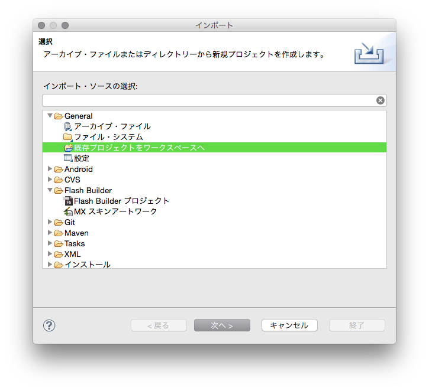

# Fox Air Extensionのビルド

本ビルド作業は、現在お使いのFlex SDKバージョンに含まれるadbを用いてANEファイルを作成します。

### ビルド完了までの流れ

1. [xmlファイルの編集](#edit_xml) : `conf/`内のxmlファイルのAirSDKバージョンの設定
2. [FoxExtensionProjのビルド](#clean_project)
3. [buildを実行](#perform_build) : FoxExtension.aneの作成
4. ANEファイル作成完了!

## 1. 環境

### 1.1 ビルド環境

* Mac OS X (10.8)以上
* [Adobe Air SDK](http://www.adobe.com/devnet/air/air-sdk-download.html)が導入されていること
* Flash Builder

> ※ Windows環境はサポートしておりません。
>
> ※ Adobe Air SDKのバージョンは現在開発に使われているバージョンで問題ありません。
>
> ※ F.O.X iOS/Android SDK バージョン4.X.X系はサポートしておりません。

### 1.2 ビルドプロジェクト

本リポジトリの[`FoxExtensionProj`](/FoxExtensionProj)がビルドプロジェクトとなっています。

```
FoxExtensionProj
          ├ ANE-LIB_Fox_iOS
          ├ conf
          ├ gps
          ├ src
          └ build
```

|ファイル名|種類|詳細|
|:---|:---:|:---|
|ANE-LIB_Fox_iOS|ディレクトリ|Fox iOS Native SDKのラッパープロジェクトを格納しています。<br>本ビルド作業で編集することはありません。|
|conf|ディレクトリ|ビルドに必要となるANE作成用の設定ファイル(xml)を格納しています。|
|gps|ディレクトリ|GooglePlayServices(version 4.4 (4452000))を格納しています。|
|src|ディレクトリ|ActionScriptによるラッパーコードを格納しています。<br>本ビルド作業で編集することはありません。|
|build|実行ファイル|ビルドを実行するファイルとなります。|

## 2. ビルド

<div id="edit_xml"></div>

### 2.1 xmlファイルの編集

FoxExtensionProj/confに格納されている以下4つのxmlファイルのplatformタグに記載されているAdobeAirSDKバージョンを編集します。

* android_options_withoutGPS.xml
* android_options.xml
* extension.xml
* iOS_options.xml

各ファイルをテキストエディターで開くと、&lt;platform&gt;にAdobeAirSDKのバージョンが記載されています。<br>
（上記、４つのファイルでは標準で20.0を指定しています。）
記載されているバージョンをお使いのAdobeAirSDKバージョンに合わせて編集してください。

`http://ns.adobe.com/air/extension/XX.X`

＜編集前＞
```xml
<platform xmlns="http://ns.adobe.com/air/extension/20.0">
```

＜編集後＞<br>
Adobe Air SDK version 21.0を使っている場合
```xml
<platform xmlns="http://ns.adobe.com/air/extension/21.0">
```

<div id="clean_project"></div>

### 2.2 プロジェクトのビルド

* Flash Builderに`FoxExtensionProj`プロジェクトをインポートします。
* FoxExtensionProjプロジェクトをメニューから[プロジェクト] > [クリーン]を実行します。
* FoxExtensionProj/bin/FoxExtensionProj.swcが作成されたら完了です。

[プロジェクトのインポート]


[クリーンを選択する]<br>


[FoxExtensionProjプロジェクトをクリーンする]<br>


<div id="perform_build"></div>

### 2.3 buildを実行

1. ターミナルからbuildを実行してください。
```
> ./build
```

2. Flex SDKのHomeディレクトリのパスを入力してEnterを押してください(adbを実行するために必要となります)。<br>
 → [FlexSDKのパスの確認](./FLEX_SDK.md)
```
> Please input local "Flex SDK Home" path (e.g. /Applications/Adobe\ Flash\ Builder\ 4.7/sdks/4.6.0_air20):
```

3. ANEファイルに組み込むネイティブ版のFox iOS SDKのバージョンを指定します。そのままEnterを押した場合、3.2.0が標準で指定されます。<br>
 → [Fox iOS SDKリリースページ](https://github.com/cyber-z/public-fox-ios-sdk/releases)（最新バージョンの指定を推奨）
```
> Please input FOX iOS SDK "Version" that has ANE (default 3.2.0):
```

4. ANEファイルに組み込むネイティブ版のFox Android SDKのバージョンを指定します。そのままEnterを押した場合、3.2.0が標準で指定されます。<br>
 → [Fox Android SDKリリースページ](https://github.com/cyber-z/public-fox-android-sdk/releases)（最新バージョンの指定を推奨）
```
> Please input FOX Android SDK "Version" that has ANE (default 3.2.0):
```

5. GooglePlayServicesを組み込む場合、`y`を入力してEnterを押します。(AdvertisingIDを取得する場合、`y`を入力してください。既に組み込まれている場合は不要です。)<br>Enterを押すとビルドが開始されます。
```
> Includes the Google Play Services? (y/n) (default y):
```

6. 以下が表示さるとビルド成功です。`FoxExtensionProj/output`にFoxExtension.aneが作成されています。
```
Created FoxExtension.ane to output
=== BUILD COMPLETED! ===
```

---
[AIRエクステンション導入手順](/lang/ja/README.md#integration_flashbuilder)

[トップ](/lang/ja/README.md)
