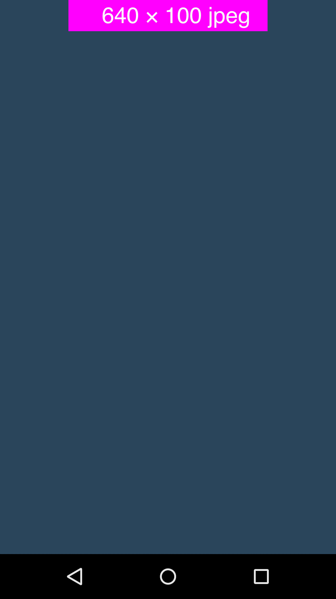
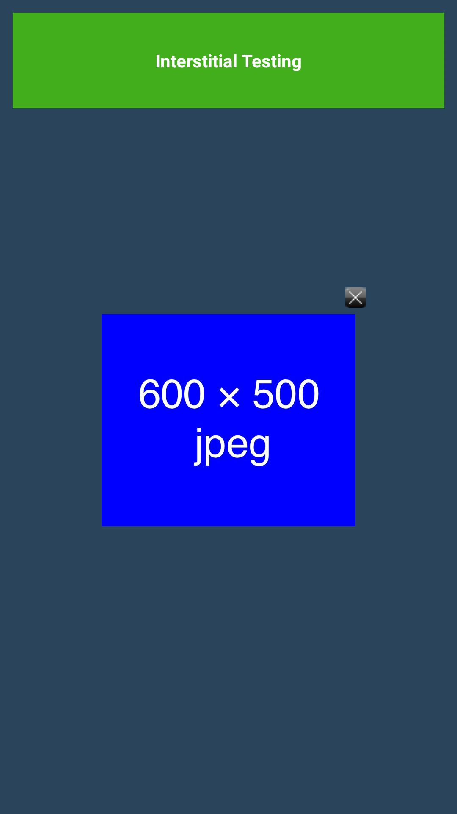
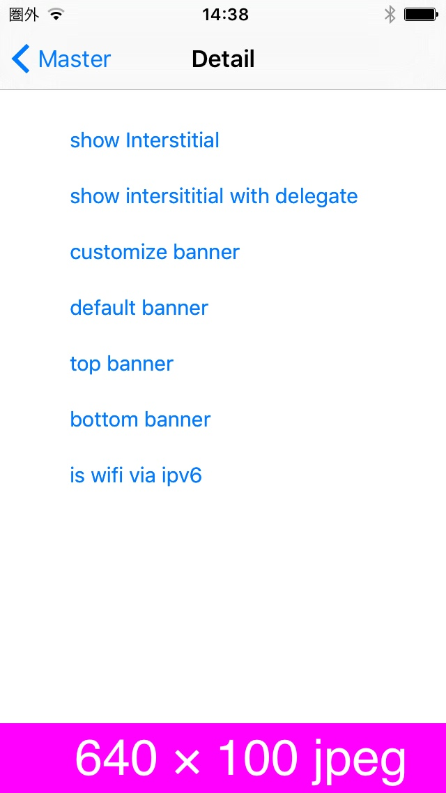

# 広告配信機能

## 1. 環境設定

### 1.1 Android

組み込み対象のアプリにはGooglePlayServicesをご導入の上、AdvertisingIDを取得出来ることが必須となっております。<br>
本SDKのGooglePlayServices同梱版あるいは、別途、他ANEよりご導入頂く必要があります。

### AndroidManifest.xmlの設定

**[Activityの追加]**

インタースティシャル広告を表示する際に必須となるActivityとなります。<br>
以下、そのままコピーして&lt;application&gt;タグ内にご設定ください。

```xml
<activity
    android:name="co.cyberz.dahlia.DahliaActivity"
    android:theme="@android:style/Theme.Translucent" />
```

**[GooglePlayServicesの追加]**

本SDKのGooglePlayServices同梱版を導入される場合、以下のバージョンを指定ください。

```xml
<meta-data
		android:name="com.google.android.gms.version"
		android:value="4452000" />
```

### 1.2 iOS

### 内部で使用しているframework

* UIKit.framework
* AdSupport.framework
* SystemConfiguration.framework
* Security.framework


## 2. API

### Banner

|返り値型|メソッド|詳細|
|---:|:---|:---|
|void|show ( String placementId, int position )<br><br>`placementID` : 広告表示ID (管理者より発行されます)<br>`position` : 配置位置<br>　　POSITION_TOP : 画面上部中央に配置<br>　　POSITION_BOTTOM : 画面下部中央に配置<br>　　POSITION_TOP_LEFT : 画面上部左に配置<br>　　POSITION_TOP_RIGHT : 画面上部右に配置<br>　　POSITION_BOTTOM_LEFT : 画面下部左に配置<br>　　POSITION_RIGHT : 画面下部右に配置|バナー広告を表示します。|
|void|hide (  )|バナー広告を非表示にします。|

### BannerEvent
|イベント|詳細|
|:---|:---|
|AD_SUCCESS|正常にバナー広告が表示された場合に呼ばれます。|
|AD_FAILED|バナー広告の表示に失敗した場合に呼ばれます。|

### Interstitial

|返り値型|メソッド|詳細|
|---:|:---|:---|
|void|show ( String placementId )<br><br>`placementID` : 広告表示ID (管理者より発行されます)|インタースティシャル広告を表示します。|

### InterstitialEvent
|イベント|詳細|
|:---|:---|
|AD_SUCCESS|正常にインタースティシャル広告が表示された場合に呼ばれます。|
|AD_FAILED|インタースティシャル広告の表示に失敗した場合に呼ばれます。|
|AD_CLOSED|インタースティシャル広告が閉じられた場合に呼ばれます。|

> インタースティシャル広告が表示できなかった場合、`AdFailed`が呼ばれた後にも`AdClosed`は呼ばれます。

### AdOperation

広告表示をカスタマイズする際に使用するAPI

|返り値型|メソッド|詳細|
|---:|:---|:---|
|-|AdOperation ( )|コンストラクター|
|void|requestAdInfo ( String placementId )<br><br>`placementID` : 広告表示ID (管理者より発行されます)|広告情報要求API。広告表示に必要なJSONオブジェクトをaddEventListenerによって返します|
|void|sendImp ( String placementId, String sessionId, boolean impStatus )<br><br>`placementID` : 広告表示ID (管理者より発行されます)、requestAdInfoで指定したものと同じIDを指定します。<br>`sessionId` : JSONオブジェクトに含まれるセッションID<br>`impStatus` : 広告表示の正否をbooleanで指定|requestAdInfoで取得した広告が表示ができたかを送信するためのAPI。JSONに含まれている`session`を指定する必要があります。|
|void|sendClick ( String placementId, String sessionId )<br><br>`placementID` : 広告表示ID (管理者より発行されます)、requestAdInfoで指定したものと同じIDを指定します。<br>`sessionId` : JSONオブジェクトに含まれるセッションID|requestAdInfoで取得した広告がタップされたことを送信するためのAPI。JSONに含まれている`session`を指定する必要があります。|

### AdOperationEvent

広告情報のリクエストAPIのコールバック

|返り値型|メソッド|詳細|
|---:|:---|:---|
|AD_SUCCESS|正常に広告情報を取得できた場合に呼ばれます。|
|AD_FAILED|広告情報の取得に失敗した場合に呼ばれます。|

## 3. コードへの組み込み

### 広告表示サンプル

```as3
<fx:Script>
	<![CDATA[
    import co.cyberz.dahlia.Banner;
    import co.cyberz.dahlia.Interstitial;

    private var banner:Banner;

    ...

    protected function button_showBannerTop(event:MouseEvent):void {
				banner = new Banner();
				banner.addEventListener(BannerEvent.AD_SUCCESS, loadBannerSuccess);
        banner.addEventListener(BannerEvent.AD_FAILED, loadBannerFailed);
				banner.show("広告表示ID", Banner.POSITION_TOP);
			}

			protected function button_showBannerBottom(event:MouseEvent):void {
				banner = new Banner();
        banner.addEventListener(BannerEvent.AD_SUCCESS, loadBannerSuccess);
        banner.addEventListener(BannerEvent.AD_FAILED, loadBannerFailed);
				banner.show("広告表示ID", Banner.POSITION_BOTTOM);
			}

			protected function button_hideBanner(event:MouseEvent):void {
				banner.hide();
			}

			protected function button_showInterstitial(event:MouseEvent):void {
				var interstitial:Interstitial = new Interstitial();
				interstitial.addEventListener(InterstitialEvent.AD_SUCCESS, loadInterstitialSuccess);
        interstitial.addEventListener(InterstitialEvent.AD_FAILED, loadInterstitialFailed);
        interstitial.addEventListener(InterstitialEvent.AD_CLOSED, loadInterstitialClosed);
				interstitial.show("広告表示ID");
			}

			private function loadBannerSuccess(event:BannerEvent):void {
				trace("Banner STATUS : Success!!");
			}

      private function loadBannerFailed(event:BannerEvent):void {
				trace("Banner STATUS : Failed!!");
			}

			private function loadInterstitialSuccess(event:InterstitialEvent):void {
				trace("Interstitial STATUS : Success!!");
			}

      private function loadInterstitialFailed(event:InterstitialEvent):void {
				trace("Interstitial STATUS : Failed!!");
			}

      private function loadInterstitialClosed(event:InterstitialEvent):void {
				trace("Interstitial STATUS : Closed!!");
			}

      ...

  ]]>
</fx:Script>
```

### 広告情報取得サンプル

```as3
var adO:AdOperation = new AdOperation();
adO.addEventListener(AdOperationEvent.AD_SUCCESS, loadAdInfoSuccess);
adO.addEventListener(AdOperationEvent.AD_FAILED, loadAdInfoFailed);
adO.requestAdInfo("広告表示ID");

private function loadAdInfoSuccess(event:AdOperationEvent):void {
  var json:Object = event.data;
  AdOperation.sendImp("広告表示ID", true, json.session);
}

private function loadAdInfoFailed(event:AdOperationEvent):void {
  // 取得失敗
}

protected function button_ClickAd(event:MouseEvent):void {
	// 広告をクリックした時
	AdOperation.sendClick("広告表示ID", json.session);
}

```

## 4. 表示サンプル

### [Android]

<table>
<tr>
<td align="center" style="border-style:none;">[バナー広告サンプル]</td>
<td align="center" style="border-style:none;">[インタースティシャル広告サンプル]</td>
</tr>
<tr>
<td style="border-style:none;"></td>
<td style="border-style:none;"></td>
</tr>
</table>

### [iOS]

<table>
<tr>
<td align="center" style="border-style:none;">[バナー広告サンプル]</td>
<td align="center" style="border-style:none;">[インタースティシャル広告サンプル]</td>
</tr>
<tr>
<td style="border-style:none;"></td>
<td style="border-style:none;"></td>
</tr>
</table>

---
[トップ](/lang/ja/README.md)
